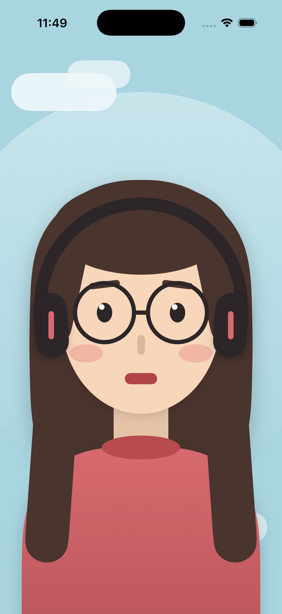

# 戴耳機的午後（Afternoon with Headphones）

SwiftUI 形狀練習作業 — 只用 SwiftUI 內建的基本形狀與 `ZStack`，不使用任何圖片素材，畫出一位朋友的肖像。

## 作品畫面

iPhone 17 Pro 模擬器實際執行畫面：



## 設計說明

整張圖是一個 `ZStack`，由後往前疊：背景天空 → 光暈與雲 → 頭髮 → 脖子 → 毛衣 → 臉 → 五官 → 耳機。
愈晚寫的形狀愈靠前，所以疊放順序就是繪圖順序。

| 部位 | 使用的形狀 | 備註 |
|---|---|---|
| 全螢幕背景 | `Color("Sky")` + `.ignoresSafeArea()` | 顏色取自 Assets |
| 背景光暈 | `Ellipse` | `Gradient` 漸層 + `opacity` |
| 雲 | `Capsule` | 兩顆疊出蓬鬆感 |
| 身體（毛衣） | `UnevenRoundedRectangle` | 上緣圓、下緣方，做出肩線 |
| 長髮 | `RoundedRectangle`（圓角 150）、`Capsule` | 胸前兩束用 `rotationEffect` 微轉 |
| 脖子 | `Rectangle` | `brightness(-0.07)` 壓出下巴陰影 |
| 領口 | `Ellipse` | `brightness` 壓暗 |
| 臉 | `Ellipse` | 比 `Circle` 更接近鵝蛋臉 |
| 瀏海 | `Ellipse` | 下緣自然成弧線 |
| 眉毛、鼻子、嘴 | `Capsule` | 眉毛加 `rotationEffect` |
| 眼睛 | `Ellipse` + `Circle`（反光） | |
| 眼鏡 | `Circle().stroke()` + `Capsule` | 只畫外框當鏡框 |
| 腮紅 | `Ellipse` | `opacity(0.45)` |
| 耳機頭帶 | `Circle().trim(from: 0.5, to: 1.0).stroke()` | 半圓弧線跨過頭頂 |
| 耳罩 | `Capsule` + `RoundedRectangle` | `shadow` 做出立體感 |

作業要求的六種形狀（`Rectangle`、`Circle`、`Ellipse`、`Capsule`、`RoundedRectangle`、`UnevenRoundedRectangle`）全部用到。

## 顏色（Assets.xcassets，以 RGB 設定）

| 名稱 | RGB | 用途 |
|---|---|---|
| Sky | 168, 213, 224 | 背景天空 |
| Cloud | 239, 247, 250 | 雲與光暈 |
| Skin | 247, 214, 186 | 膚色 |
| Hair | 74, 52, 46 | 頭髮 |
| Sweater | 214, 106, 110 | 毛衣 |
| SweaterDark | 180, 82, 88 | 毛衣漸層下緣、領口 |
| Blush | 235, 142, 140 | 腮紅 |
| Ink | 45, 38, 40 | 眼睛、眼鏡、耳機 |

## 使用的 modifier

`frame` / `offset` / `foregroundStyle` / `opacity` / `brightness` / `rotationEffect` / `shadow` / `stroke` / `trim` / `ignoresSafeArea`

## 執行方式

1. Xcode 開新專案：**iOS → App**，Interface 選 SwiftUI，專案命名為 `SelfPortrait`。
2. 把 `SelfPortrait/ContentView.swift` 與 `SelfPortrait/SelfPortraitApp.swift` 覆蓋到新專案對應檔案。
3. 把 `SelfPortrait/Assets.xcassets` 裡的 8 組 `.colorset` 資料夾複製進專案的 `Assets.xcassets`，或在 Xcode 裡用 New Color Set 依上表的 RGB 逐一建立。
4. 選 iPhone 模擬器後 ⌘R 執行；也可以直接在 Canvas 用 `#Preview` 看結果。

需求環境：Xcode 15 以上（`UnevenRoundedRectangle` 需要 iOS 17 / SwiftUI 5）。

## 檔案結構

```
swiftui-self-portrait/
├── README.md
├── simulator-screenshot.png  # 模擬器執行截圖
├── screenshot.png            # 去掉狀態列的純畫面
├── SelfPortrait.xcodeproj/   # Xcode 專案
└── SelfPortrait/
    ├── ContentView.swift     # 肖像本體
    ├── SelfPortraitApp.swift # App 進入點
    └── Assets.xcassets/      # 8 組 RGB 顏色
```

## 參考

- Apple《Build with stacks and shapes》自畫像範例
- 彼得潘的 Swift iOS App 開發問題解答集：[參考 Apple 的 Build with stacks and shapes 用形狀創作自畫像](https://medium.com/%E5%BD%BC%E5%BE%97%E6%BD%98%E7%9A%84%E8%A9%A6%E7%85%89-%E5%8B%87%E8%80%85%E7%9A%84-100-%E9%81%93-swift-ios-app-%E8%AC%8E%E9%A1%8C/206-%E5%8F%83%E8%80%83-apple-%E7%9A%84-build-with-stacks-and-shapes-%E7%94%A8%E5%BD%A2%E7%8B%80%E5%89%B5%E4%BD%9C%E8%87%AA%E7%95%AB%E5%83%8F-self-portrait-b4d4a8eef55e)
